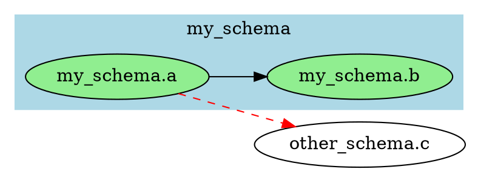
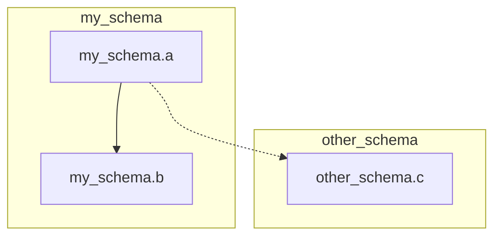

# Quick Pickup Guide for Next Session

## TL;DR Status
- ✅ **Phases 1, 2, 2.5, 3, 4 & 5 COMPLETE**: Full analysis suite, cleanup operations, and schema analysis working perfectly!
- ✅ **All Tests Passing**: 83/83 tests (40 unit + 25 analysis + 11 clean + 7 schema)
- ✅ **Zero Clippy Warnings**: Clean, production-ready code
- 🎯 **Next Task**: Implement Phase 6 - Export Capabilities

## What Just Happened

### Major Win: Phase 5 Complete! 🎉

Successfully implemented comprehensive schema analysis features:

**Schema Extraction & Commands:**
- ✅ Automatic schema extraction from node names (`schema.table`, `schema::table`)
- ✅ `schema list` - Display all schemas with statistics and bar charts
- ✅ `schema analyze <name>` - Detailed schema view with dependencies
- ✅ `schema dependencies` - Cross-schema dependency visualization
- ✅ `--schema` filter for analyze and clean commands

**New features implemented:**
- ✅ Added `schema: Option<String>` field to FileNode
- ✅ 6 helper methods on TCGraph for schema operations
- ✅ Beautiful table output with bar charts showing distribution
- ✅ Color-coded cross-schema dependency tables
- ✅ Internal vs external dependency analysis
- ✅ Dependent schema tracking

**Implementation stats:**
- Created `src/commands/schema.rs` (265 lines)
- Modified `src/file_node.rs` (+15 lines for schema extraction)
- Modified `src/file_dag.rs` (+120 lines for schema helpers)
- Created `tests/schema_tests.rs` with 7 comprehensive tests
- All 83 tests passing
- Zero clippy warnings

## Next Priority: Phase 6 - Export Capabilities 🎯

**Goal**: Add graph export in multiple formats for visualization and integration

### Why Phase 6 Now?

With analysis, cleanup, and schema features complete, users need ways to export dependency graphs for visualization, documentation, and integration with other tools. Export capabilities enable:
- Visual graph exploration with GraphViz/Gephi
- Integration with documentation systems
- API consumption via JSON
- Lightweight diagrams via Mermaid

### Implementation Tasks

See `IMPLEMENTATION_PLAN.md` Phase 6 for full task list. Key features to implement:

#### Export Commands to Implement

1. **JSON Export** - Full metadata export
   ```bash
   topcat export json -i sql/ -e sql -o graph.json
   ```
   - Complete node metadata (name, path, layer, schema, dependencies)
   - Edge information (source, target, type)
   - Schema groupings
   - Statistics (node counts, edge counts, schema counts)

2. **Enhanced DOT Export** - GraphViz with schema colors
   ```bash
   topcat export dot -i sql/ -e sql -o graph.dot
   ```
   - Schema-based node coloring
   - Layer-based subgraphs
   - Edge styling based on dependency type
   - Optional: filter by schema

3. **GraphML Export** - Standard graph format
   ```bash
   topcat export graphml -i sql/ -e sql -o graph.graphml
   ```
   - Compatible with Gephi, yEd, Cytoscape
   - Node attributes (schema, layer, path)
   - Edge attributes (dependency type)

4. **Mermaid Diagram** - Markdown-embeddable diagrams
   ```bash
   topcat export mermaid -i sql/ -e sql -o graph.md
   ```
   - Flowchart format for dependency graphs
   - Schema-based subgraphs
   - Clickable links to files

5. **Export Modes** - Control what gets exported
   ```bash
   topcat export json -i sql/ -e sql --mode full -o graph.json
   topcat export dot -i sql/ -e sql --mode deps --node my_schema.a -o deps.dot
   topcat export json -i sql/ -e sql --mode dependents --node my_schema.a -o dependents.json
   topcat export mermaid -i sql/ -e sql --mode direct --node my_schema.a -o direct.md
   ```
   - `full` - Complete graph (default)
   - `deps` - Node and all its dependencies (transitive)
   - `dependents` - Node and all its dependents (reverse transitive)
   - `direct` - Node and direct neighbors only

### Quick Start Commands

```bash
# Build and test
cargo build
cargo test --lib --tests
cargo clippy --all-targets

# Test existing functionality
./target/debug/topcat schema --input-dirs tests/input/sql --include-exts sql list
./target/debug/topcat analyze -i tests/input/sql -e sql --schema my_schema orphans

# After implementing Phase 6:
./target/debug/topcat export json -i tests/input/sql -e sql -o /tmp/graph.json
./target/debug/topcat export dot -i tests/input/sql -e sql -o /tmp/graph.dot
./target/debug/topcat export mermaid -i tests/input/sql -e sql -o /tmp/graph.md
```

## Key Files Reference

- **`IMPLEMENTATION_PLAN.md`** - Phase 6 has the detailed task breakdown
- **`STATUS.md`** - Updated with Phase 5 completion
- **`src/file_dag.rs`** - Core graph structure (732 lines, includes schema methods)
- **`src/main.rs`** - Add Export command variant
- **`src/commands/`** - Create export.rs module
- **`tests/`** - Add export integration tests

## Important Context

### Export Command Structure (New for Phase 6)

The export command will follow this pattern:

```rust
#[derive(Debug, Subcommand)]
enum ExportCommand {
    /// Export as JSON with full metadata
    Json,
    /// Export as DOT format for GraphViz
    Dot,
    /// Export as GraphML for Gephi/yEd
    Graphml,
    /// Export as Mermaid diagram
    Mermaid,
}

#[derive(Debug, Args)]
pub struct ExportArgs {
    // Common input args
    #[arg(short = 'i', long = "input-dirs")]
    input_dirs: Vec<PathBuf>,

    #[arg(short = 'o', long = "output")]
    output: PathBuf,

    // Export mode
    #[arg(long = "mode", default_value = "full")]
    mode: ExportMode,

    // Optional node for filtered exports
    #[arg(long = "node")]
    node: Option<String>,

    // Optional schema filter
    #[arg(long = "schema")]
    schema: Option<Vec<String>>,

    #[command(subcommand)]
    command: ExportCommand,
}

#[derive(Debug, Clone)]
enum ExportMode {
    Full,
    Deps,
    Dependents,
    Direct,
}
```

### JSON Export Format

Proposed structure for JSON exports:

```json
{
  "metadata": {
    "version": "0.2.4",
    "generated_at": "2025-10-31T12:00:00Z",
    "node_count": 6,
    "edge_count": 8,
    "schema_count": 3
  },
  "schemas": [
    {
      "name": "my_schema",
      "node_count": 3,
      "internal_deps": 2,
      "external_deps": 1
    }
  ],
  "nodes": [
    {
      "name": "my_schema.a",
      "path": "sql/my_schema/a.sql",
      "layer": "normal",
      "schema": "my_schema",
      "dependencies": ["my_schema.b"],
      "dependents": [],
      "node_type": "leaf"
    }
  ],
  "edges": [
    {
      "source": "my_schema.a",
      "target": "my_schema.b",
      "type": "requires"
    }
  ]
}
```

### DOT Export with Schema Colors



### Mermaid Format



## Phase 6 Implementation Strategy

### 1. Create Export Module (Foundation)
- Create `src/commands/export.rs`
- Define ExportArgs, ExportCommand, ExportMode
- Add to main.rs Commands enum
- Implement basic graph building (reuse from analyze)

### 2. JSON Export (Easy Start)
- Implement JSON serialization using serde
- Include all metadata
- Add schema information
- Add statistics
- Test with various graph sizes

### 3. DOT Export Enhancement (Medium)
- Enhance existing DOT output in concat command
- Add schema-based coloring
- Add layer-based subgraphs
- Add filtering options
- Test visual output with GraphViz

### 4. GraphML Export (Medium)
- Research GraphML XML format
- Implement node and edge serialization
- Add attributes (schema, layer, path)
- Test with Gephi/yEd

### 5. Mermaid Export (Medium)
- Implement Mermaid flowchart syntax
- Add schema-based subgraphs
- Handle large graphs (pagination/filtering)
- Test in Markdown viewers

### 6. Export Modes (Advanced)
- Implement transitive dependency calculation
- Implement reverse transitive (dependents)
- Implement direct neighbors only
- Add to all export formats

## After Phase 6: Future Phases

### Phase 7: Configuration & Polish
- Auto-discovery of `.topcat.toml`
- Shell completions (bash, zsh, fish)
- Man pages
- Performance optimizations for large codebases

### Phase 8: Documentation & Skills
- Complete README update with all commands
- User guide with real-world examples
- Create Claude Code skills for common workflows
- API documentation

## Success Criteria

Phase 6 is complete when:
1. ✅ JSON export works with complete metadata
2. ✅ DOT export includes schema colors and filtering
3. ✅ GraphML export is compatible with Gephi
4. ✅ Mermaid export generates valid diagrams
5. ✅ Export modes (full, deps, dependents, direct) work for all formats
6. ✅ Schema filtering works in exports
7. ✅ All tests pass (expect 90+ tests after Phase 6)
8. ✅ `cargo clippy` passes with zero warnings
9. ✅ Manual testing confirms exports are usable
10. ✅ Integration tests cover export operations
11. ✅ Documentation updated

## Current Test Stats

```
✅ All 83 tests passing
   - 40 unit tests
   - 25 analysis integration tests
   - 11 clean integration tests
   - 7 schema integration tests

✅ Zero clippy warnings
✅ Clean build
```

## Useful Debug Commands

```bash
# Run specific test
cargo test --test schema_tests test_get_schemas -- --nocapture

# Run all integration tests
cargo test --lib --tests

# Check for warnings
cargo clippy --all-targets

# Build and test schema command
cargo build && ./target/debug/topcat schema --input-dirs tests/input/sql --include-exts sql list

# Test schema filtering
cargo build && ./target/debug/topcat analyze -i tests/input/sql -e sql --schema my_schema orphans
```

## Phase 6 Specific Notes

### Serde for JSON Export

Add to Cargo.toml:
```toml
[dependencies]
serde = { version = "1.0", features = ["derive"] }
serde_json = "1.0"
```

Then derive Serialize on data structures:
```rust
#[derive(Debug, Serialize)]
struct GraphExport {
    metadata: Metadata,
    schemas: Vec<SchemaInfo>,
    nodes: Vec<NodeExport>,
    edges: Vec<EdgeExport>,
}
```

### GraphML XML Structure

Basic structure:
```xml
<?xml version="1.0" encoding="UTF-8"?>
<graphml xmlns="http://graphml.graphdrawing.org/xmlns">
  <key id="d0" for="node" attr.name="schema" attr.type="string"/>
  <key id="d1" for="node" attr.name="layer" attr.type="string"/>
  <graph id="G" edgedefault="directed">
    <node id="n0">
      <data key="d0">my_schema</data>
      <data key="d1">normal</data>
    </node>
    <edge source="n0" target="n1"/>
  </graph>
</graphml>
```

### Export Filtering Implementation

For export modes, need to calculate subgraphs:

```rust
impl TCGraph {
    pub fn get_transitive_dependencies(&self, node: &str) -> HashSet<String> {
        // BFS/DFS from node following dependencies
    }

    pub fn get_transitive_dependents(&self, node: &str) -> HashSet<String> {
        // BFS/DFS from node following reverse edges
    }

    pub fn get_direct_neighbors(&self, node: &str) -> (HashSet<String>, HashSet<String>) {
        // Return (dependencies, dependents)
    }
}
```

## Dependencies to Add

```toml
[dependencies]
serde = { version = "1.0", features = ["derive"] }
serde_json = "1.0"
xml-rs = "0.8"  # For GraphML export
chrono = "0.4"  # For timestamps in exports
```

## Contact/Handoff Info

- All code compiles cleanly
- All 83 tests passing (40 unit + 25 analysis + 11 clean + 7 schema)
- Phases 1, 2, 2.5, 3, 4, and 5 are production-ready
- Analysis suite complete with 8 commands
- Clean command provides safe deletion
- Schema analysis enables multi-schema organization
- IMPLEMENTATION_PLAN.md Phase 6 has everything needed for next implementation

Good luck! Phase 6 adds powerful export capabilities for visualization and integration! 🚀
