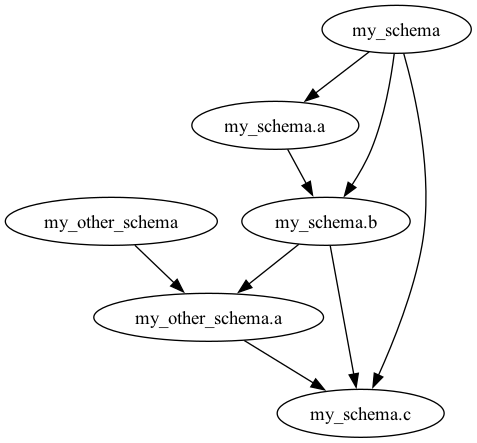

# topcat

**top**ological con**cat**enation of files

## Description

`topcat` is a simple tool to concatenate files in a topological order. It is useful when you have a set of files that
depend on each other and you want to concatenate them in the right order.

For my usecase this is SQL files.

I like to treat my SQL files as a set of functions and views that depend on each other. I like to keep them in separate
files and concatenate them in the right order to create a single file that I can run in my database.

## Usage

Lets say you have a directory with the following files:

```
sql
├── my_other_schema
│   ├── functions
│   │   ├── a.sql
│   │   ├── b.sql
│   │   └── c.sql
│   └── schema.sql
└── my_schema
    ├── functions
    │   └── a.sql
    └── schema.sql
```

And the content of the files is:

`sql/my_schema/schema.sql`:

```postgresql
-- name: my_schema

DROP SCHEMA IF EXISTS my_schema CASCADE;
CREATE SCHEMA IF NOT EXISTS my_schema;
```

`sql/my_schema/functions/a.sql`:

```postgresql
-- name: my_schema.a
-- dropped_by: my_schema

CREATE FUNCTION my_schema.a() RETURNS INT AS
$$
SELECT 1;
$$ LANGUAGE SQL IMMUTABLE
                PARALLEL SAFE;
```

`sql/my_schema/functions/b.sql`:

```postgresql
-- name: my_schema.b
-- dropped_by: my_schema
-- requires: my_schema.a

CREATE FUNCTION my_schema.b() RETURNS INT AS
$$
SELECT my_schema.a() + 1
$$ LANGUAGE SQL;
```

`sql/my_schema/functions/c.sql`:

```postgresql
-- name: my_schema.c
-- dropped_by: my_schema
-- requires: my_schema.b

CREATE FUNCTION my_schema.c() RETURNS INT AS
$$
SELECT my_schema.b() + 1
$$ LANGUAGE SQL IMMUTABLE
                PARALLEL SAFE;
```

`sql/my_other_schema/schema.sql`:

```postgresql
-- name: my_other_schema

DROP SCHEMA IF EXISTS my_schema CASCADE;
CREATE SCHEMA IF NOT EXISTS my_schema;
```

`sql/my_other_schema/functions/a.sql`:

```postgresql
-- name: my_other_schema.a
-- dropped_by: my_other_schema
-- requires: my_schema.b

CREATE FUNCTION my_other_schema.a() RETURNS INT AS
$$
SELECT my_schema.b() + 1
$$ LANGUAGE SQL IMMUTABLE
                PARALLEL SAFE;
```

So the dependency graph is:


Now you can run `topcat` to concatenate the files in the right order:

```sh
topcat -i tests/input/sql -o tests/output/sql/output.sql
```

The content of `output.sql` will be:

```postgresql
-- This file was generated by topcat. To regenerate run:
--
-- topcat -i tests/input/sql -o tests/output/sql/output.sql -v

------------------------------------------------------------------------------------------------------------------------
-- tests/input/sql/my_other_schema/schema.sql
-- name: my_schema

DROP SCHEMA IF EXISTS my_schema CASCADE;
CREATE SCHEMA IF NOT EXISTS my_schema;

------------------------------------------------------------------------------------------------------------------------
-- tests/input/sql/my_other_schema/functions/a.sql
-- name: my_schema.a
-- dropped_by: my_schema

CREATE FUNCTION my_schema.a() RETURNS INT AS
$$
SELECT 1;
$$ LANGUAGE SQL;

------------------------------------------------------------------------------------------------------------------------
-- tests/input/sql/my_other_schema/functions/b.sql
-- name: my_schema.b
-- dropped_by: my_schema
-- requires: my_schema.a

CREATE FUNCTION my_schema.b() RETURNS INT AS
$$
SELECT my_schema.a() + 1
$$ LANGUAGE SQL;

------------------------------------------------------------------------------------------------------------------------
-- tests/input/sql/my_schema/schema.sql
-- name: my_other_schema

DROP SCHEMA IF EXISTS my_other_schema CASCADE;
CREATE SCHEMA IF NOT EXISTS my_other_schema;

------------------------------------------------------------------------------------------------------------------------
-- tests/input/sql/my_schema/functions/a.sql
-- name: my_other_schema.a
-- dropped_by: my_other_schema
-- requires: my_schema.b

CREATE FUNCTION my_other_schema.a() RETURNS INT AS
$$
SELECT my_schema.b() + 1
$$ LANGUAGE SQL IMMUTABLE
                PARALLEL SAFE;

------------------------------------------------------------------------------------------------------------------------
-- tests/input/sql/my_other_schema/functions/c.sql
-- name: my_schema.c
-- dropped_by: my_schema
-- requires: my_schema.b
-- requires: my_other_schema.a

CREATE FUNCTION my_schema.c() RETURNS INT AS
$$
SELECT my_schema.b() + my_other_schema.a() + 1
$$ LANGUAGE SQL;
```

