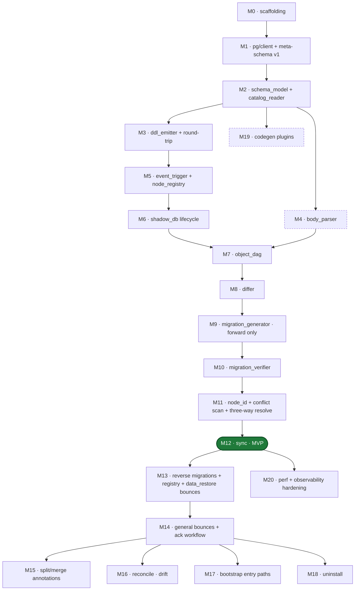

# pg-dev-buddy — milestone plans

These 21 files decompose `docs/pg-dev-buddy-roadmap.md` into one self-contained briefing per milestone. Each plan file holds enough context to bootstrap an implementation session without re-reading the full roadmap or the architecture spec.

## How to use this directory

- Kick off a session by pointing an agent at ONE plan file (e.g., "work on `docs/pg-dev-buddy-plans/m07-object-dag.md`"). The plan contains scope, prerequisites, deliverables, phases, risks, tests, and a verification snapshot — no need to re-read the roadmap.
- Prerequisites in each plan name the concrete upstream artifacts. Confirm those have landed before starting the milestone.
- After a milestone lands, update the plan file in place with a "Landed" section so the next reader sees current state.

## Milestone map

**Critical path**: M0 → M1 → M2 → M3 → M5 → M6 → M7 → M8 → M9 → M10 → M11 → M12. Everything else branches off.

**MVP**: M0 through M12. Gives you: managed dev db, object-granular sync from files, forward migration generation with verification. No reverses, no bounces, no reconcile, no codegen. Already useful.

## Plans

| # | Plan | Milestone |
|---|------|-----------|
| M0 | [m00-scaffolding.md](m00-scaffolding.md) | Config and command scaffolding |
| M1 | [m01-pg-client-meta-schema.md](m01-pg-client-meta-schema.md) | pg/client + meta-schema versioning |
| M2 | [m02-schema-model-catalog-reader.md](m02-schema-model-catalog-reader.md) | schema_model + catalog_reader |
| M3 | [m03-ddl-emitter-round-trip.md](m03-ddl-emitter-round-trip.md) | ddl_emitter + round-trip property tests |
| M4 | [m04-body-parser.md](m04-body-parser.md) | body_parser (libpg_query plpgsql) |
| M5 | [m05-event-trigger-node-registry.md](m05-event-trigger-node-registry.md) | event_trigger + node_registry |
| M6 | [m06-shadow-db-lifecycle.md](m06-shadow-db-lifecycle.md) | shadow_db lifecycle |
| M7 | [m07-object-dag.md](m07-object-dag.md) | object_dag |
| M8 | [m08-differ.md](m08-differ.md) | differ |
| M9 | [m09-migration-generator-forward.md](m09-migration-generator-forward.md) | migration_generator (forward only) |
| M10 | [m10-migration-verifier.md](m10-migration-verifier.md) | migration_verifier |
| M11 | [m11-node-id-identity.md](m11-node-id-identity.md) | node_id identity + conflict scan + three-way resolution |
| M12 | [m12-sync-mvp.md](m12-sync-mvp.md) | sync (dev loop) — MVP milestone |
| M13 | [m13-reverse-migrations.md](m13-reverse-migrations.md) | reverse migrations + registry + data_restore bounces |
| M14 | [m14-general-bounces-ack.md](m14-general-bounces-ack.md) | general bounce markers + ack workflow |
| M15 | [m15-split-merge-annotations.md](m15-split-merge-annotations.md) | split/merge annotations |
| M16 | [m16-reconcile-drift.md](m16-reconcile-drift.md) | reconcile + drift detection |
| M17 | [m17-bootstrap-entry-paths.md](m17-bootstrap-entry-paths.md) | bootstrap entry paths |
| M18 | [m18-uninstall.md](m18-uninstall.md) | uninstall |
| M19 | [m19-codegen-plugins.md](m19-codegen-plugins.md) | codegen plugins |
| M20 | [m20-perf-observability.md](m20-perf-observability.md) | perf + observability hardening |

## Also see

- `../pg-dev-buddy-roadmap.md` — the full roadmap this directory decomposes.
- `../pg-dev-buddy-architecture.md` — the architecture spec referenced from every plan.
