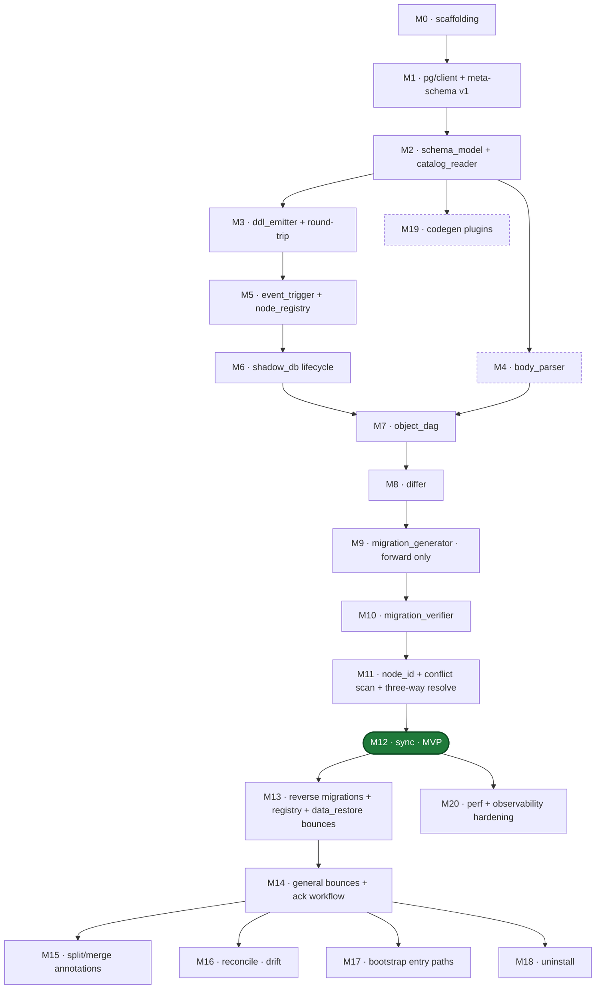

# pg-dev-buddy — implementation roadmap

Sequenced build order for `docs/pg-dev-buddy-architecture.md`. Each milestone is
sized to be a coherent, shippable slice — tests pass, CLI surface is usable,
downstream milestones can build on it without the earlier one leaking through.

**Use**: each future session tackles exactly one milestone. Confirm the
milestone's "depends on" list is complete before starting, and treat "risks"
as required-reading — the build order reflects risk-weighting, not just
dependency topology.

## Methodology

Four constraints drove the ordering:

1. **Correctness first, orchestration last.** `SchemaModel` + `ddl_emitter`
   with round-trip property tests are the foundation. A wrong normalization
   rule in M2/M3 corrupts every downstream artifact. Everything above M3 is
   orchestration on top of a trusted kernel.
2. **One big correctness bet per milestone.** `ddl_emitter` (M3),
   event-trigger bootstrapping (M5), and conflict auto-resolution (M11) each
   get their own milestone so tests focus on one failure mode at a time.
3. **Minimize mid-stack rework.** A module is only included in a milestone
   once its contract is stable. `object_dag` edge authority (M7) lands *after*
   `body_parser` (M4) so inferred edges are real, not stubbed.
4. **Parallelizable branches annotated explicitly.** Once M2 lands, `body_parser`
   (M4) and `codegen` (M19) can be built by separate sessions against a frozen
   `SchemaModel`.

## Milestone map

**Critical path**: M0 → M1 → M2 → M3 → M5 → M6 → M7 → M8 → M9 → M10 → M11 → M12.
Everything else branches off.

**MVP**: M0 through M12. Gives you: managed dev db, object-granular sync from
files, forward migration generation with verification. No reverses, no
bounces, no reconcile, no codegen. Already useful.

---

## M0 — Config and command scaffolding

**Scope**: `[postgres]` block in `topcat.toml`, `TOPCAT_*` env var plumbing,
CLI stubs for every new subcommand (return "not implemented").

**Deliverables**:
- `settings/configs/postgres.rs` (new).
- CLI parsing for `sync`, `shadow`, `diff`, `migrate`, `reconcile`,
  `write-deps`, `pause`, `resume`, `uninstall`, `meta-schema`.
- `topcat config show` displays the new block.

**Depends on**: existing `settings/` module only.

**Risks**: low. This is purely additive.

**Tests**: unit tests on config precedence; CLI stub integration tests asserting
exit codes + error messages.

**Size**: ~1 session.

---

## M1 — pg/client + meta-schema versioning

**Scope**: connection management, transaction helpers, DDL application, and
`_topcat` schema install/upgrade per architecture §`_topcat` meta-schema
versioning and the v1 DDL listing.

**Deliverables**:
- `pg/client` module: URL parsing, pool, typed error taxonomy (superuser
  missing, connection refused, version unsupported, etc.).
- `meta_migrations` module: embedded SQL for v1 (tables only; event triggers
  deferred to M5). Includes `schema_version`, `node_registry`, `node_aliases`,
  `sync_log`, `migration_registry` tables + `gen_uuidv7()` function.
- `topcat meta-schema upgrade` command.
- Bootstrap flag discipline (`SET LOCAL topcat.bootstrapping = 'true'`).

**Depends on**: M0.

**Risks**:
- Superuser requirement. Fail-closed at connect with an actionable error.
- UUIDv7 implementation. `gen_random_uuid()` is UUIDv4 — shipping a pure-SQL
  UUIDv7 body is non-trivial. Decide at M1 start: pure-SQL, require the
  `pg_uuidv7` extension, or ship a plpgsql polyfill. Pick one and commit.

**Tests**: integration tests against ephemeral pg (docker or `nix run
nixpkgs#postgresql`) across pg15/16/17. Upgrade-from-scratch and
re-run-idempotent cases.

**Size**: ~1-2 sessions.

---

## M2 — schema_model + catalog_reader

**Scope**: canonical typed representation of a db schema and the readers that
produce one. This is the single biggest milestone — it underpins every
downstream module.

**Deliverables**:
- `schema_model` crate: `Table`, `Column`, `Constraint`, `Index`, `Function`,
  `View`, `MaterializedView`, `Sequence`, `Type` (enum/composite/domain/range/
  multirange), `Trigger`, `Policy`, `Rule`, `Schema`, `Extension`, plus text
  search, FDW/server/user-mapping, operator/class/family, aggregate, cast,
  conversion, statistics, publication, access method, user-event-trigger
  types. Full list in architecture §Object types covered.
- JCS JSON serialization (RFC 8785). UTF-8, sorted keys, no insignificant
  whitespace.
- `pg/catalog_reader`: per-object-type structured reader, each returning a
  typed row stream. Filters `pg_catalog`, `information_schema`, `_topcat`,
  and extension-owned objects (`pg_depend.deptype = 'e'`).
- Normalization rules (architecture §Normalization rules table): varchar/text
  collapse, identity/serial/default union, viewdef canonicalization,
  reloptions sort, RLS `{enabled, forced, policies}`, etc.
- `topcat schema dump [--format json]` command for observability.

**Depends on**: M1 (needs `pg/client`).

**Risks** (high):
- **Normalization is where correctness lives.** Every hot spot in the
  architecture table has a reason — miss one and the differ emits spurious
  changes. Property tests must compare two catalog reads of the *same* db and
  assert structural equality.
- **Partition-tree recursion.** Sub-partitioning is listed as recursive; the
  reader must resolve parent→child without cycles and without duplicate
  emission for multi-level hierarchies.
- **Collation version hashes.** pg15+ carries collation version on catalog
  rows; the architecture strips these. Verify this is always safe (it is, for
  schema-intent diffing — but verify).

**Tests**:
- Fixture schemas covering every object type × every normalization hot spot.
- Read twice, assert equal. (Catches non-determinism.)
- Read an upstream db, dump JCS JSON, diff with `git diff --no-index` — a
  single byte of churn fails the test.

**Size**: ~3-5 sessions. Worth splitting M2a (core objects: tables, columns,
constraints, indexes, functions, views, sequences, types, schemas,
extensions) and M2b (long tail: triggers, policies, rules, text search,
FDW, operators, aggregates, casts, conversions, statistics, publications,
access methods, event triggers).

---

## M3 — ddl_emitter + round-trip property tests

**Scope**: `SchemaModel` → DDL for every object type, plus the property test
that gives everything downstream its correctness foundation.

**Deliverables**:
- `pg/ddl_emitter` module with per-object-type emitters.
- Round-trip property test: given a fixture db, read → emit → apply to a
  fresh db → read → assert `SchemaModel` equality.
- CLI: emitter output is reachable via an internal debug command (not a
  user-facing `topcat emit` — too easy to misuse).

**Depends on**: M2.

**Risks** (high):
- This is the single authoritative SchemaModel→DDL path (architecture
  §CatalogReader). If it's wrong, sync re-apply and migration generation
  both produce garbage.
- DDL ordering *within* an emit of a single object (e.g. table body, indexes,
  constraints, RLS) — the emitter owns this, not the caller. Specify the
  order up front.
- Function bodies use exact `pg_proc.prosrc` text — no whitespace normalization.
  But emitted DDL must re-yield the same `prosrc`. Round-trip catches drift.

**Tests**:
- Property test as above, run across pg15/16/17.
- Fixture coverage: every normalization hot spot, every partition strategy,
  inheritance, generated columns, identity columns, RLS with forced/enabled
  toggles, cross-schema references.

**Size**: ~2-3 sessions.

---

## M4 — body_parser (libpg_query plpgsql)

**Scope**: plpgsql dependency extraction for inferred edges.

**Deliverables**:
- `pg/body_parser` module wrapping `pg_query_parse_plpgsql`.
- Extraction of supported patterns (architecture §Supported plpgsql
  patterns): embedded SQL, `RETURN QUERY`, function calls, type refs, static
  cursors, literal-string `EXECUTE`, `format()` with literal templates.
- `parse_status` enum: `ok`, `failed`, `dynamic_sql`, `dynamic_ddl`.
- Identifier resolution via `pg_proc.proconfig` search_path or cluster default.

**Depends on**: M2 (SchemaModel types for edge targets).

**Risks**:
- libpg_query's plpgsql AST is less stable than its SQL AST. Pin the version
  and lock behavior with golden-file tests.
- Identifier resolution: unqualified references can hit the wrong target.
  The architecture specifies `pg_proc.proconfig` search_path fallback —
  verify this matches pg's runtime resolution exactly.

**Tests**: golden-file tests on a fixture set covering every supported and
unsupported pattern.

**Size**: ~1-2 sessions.

**Parallelizable with**: M3 (after M2 lands), M19.

---

## M5 — event_trigger + node_registry

**Scope**: install event triggers on a managed db, capture DDL, populate
registry atomically with DDL transactions.

**Deliverables**:
- `pg/event_trigger` module: install/uninstall, tag filter, bootstrap flag
  handling.
- `_topcat_ddl_end` and `_topcat_sql_drop` triggers (from architecture §v1
  DDL), now live.
- `topcat pause` / `topcat resume` commands for bulk restore (pg_restore
  path).
- Handling of every item in architecture §Tag inventory (captured,
  out-of-list, gap cases).
- UUIDv7 assignment confirmed working end-to-end (M1 shipped the function;
  M5 proves the registry populates with time-ordered IDs).

**Depends on**: M1, M2 (for structural inspection of observed objects).

**Risks** (high):
- **Superuser required to install event triggers.** Retry/detection logic
  and actionable error.
- **Bootstrap chicken-and-egg.** `_topcat` schema must exist before the
  trigger installs; the install transaction sets `topcat.bootstrapping = true`
  so the trigger ignores itself. Test: trigger does not fire on its own
  CREATE.
- **Dynamic DDL inside function bodies.** Catalog rows get created whose
  `pg_depend` doesn't link to the originator. M5 must flag these (orphan
  managed) and surface in sync as `parse_status = dynamic_ddl` at the caller
  function. Escape hatch `--allow-dynamic-ddl` lives in migration_generator
  (M9) but the registry capture happens here.
- **Extension-owned objects** (`deptype = 'e'`) must be excluded from
  `node_registry`. Verify the trigger respects the filter.
- **User-created event triggers**. Managed like other objects; topcat's own
  triggers excluded by name.

**Tests**: integration tests against ephemeral pg. Apply DDL, inspect
registry. Restore-path test: `pause` → apply a dump → `resume` → full-catalog
rescan repopulates registry correctly.

**Size**: ~2 sessions.

---

## M6 — shadow_db lifecycle

**Scope**: `shadow_main`, `shadow_head`, `shadow_verify` creation, template
reuse, caching.

**Deliverables**:
- `shadow_db` module: connection routing to the shadow cluster (separate
  from dev db per architecture §Config surface), template-based creation
  via `CREATE DATABASE … TEMPLATE`, per-input SHA-256 cache.
- Event trigger installed on every shadow (observational, via M5).
- `topcat shadow build [main|head|verify]` and `topcat shadow clean` CLI.
- Cache directory config (`shadow_main_cache_dir`).

**Depends on**: M1, M2, M5.

**Risks**:
- `CREATE DATABASE ... TEMPLATE` requires zero active connections to the
  template. Connection-close discipline matters.
- Cache key is SHA-256 over sorted file-set (path + content). Verify this
  excludes `-- node_id:` header churn that rewrites on node_id auto-resolution
  — otherwise the cache thrashes post-merge.
- Performance target: `< 2s` for template reuse, `< 90s` for 1000-object
  fresh build (architecture §Performance). Measure early.

**Tests**: integration tests covering cache hit, cache miss, template reuse,
concurrent shadow_head rebuilds serialize correctly.

**Size**: ~1-2 sessions.

---

## M7 — object_dag

**Scope**: dependency graph at object granularity with three edge sources.

**Deliverables**:
- `object_dag` module with nodes (node_id, pg_address, file, parse_status)
  and edges (`catalog`, `inferred`, `declared`; confidence, source_location).
- Edge authority rules (architecture §Edge authority).
- Stale declared edge detection (warn in dev, fail in migration generation).
- `-- exists:` remains a File DAG concept; produces no Object DAG edges
  (architecture §`-- exists:` in the Object DAG).

**Depends on**: M2 (catalog reads), M4 (inferred edges).

**Risks**:
- Three-way edge reconciliation can produce confusing diagnostics. Log
  conflicts with enough detail that `diff.edge.conflict` is actionable.
- Declared edges referencing names that don't resolve: warn in dev,
  fail-closed in migration. This policy must be consistent between sync and
  migrate.

**Tests**: unit tests on edge authority truth table. Integration tests
against fixture schemas covering catalog-only, inferred-only, declared-only,
and mixed cases.

**Size**: ~1-2 sessions.

---

## M8 — differ

**Scope**: `SchemaModel × SchemaModel → ChangeSet`.

**Deliverables**:
- `differ` module: per-object-type structural equality, normalized.
- `ChangeSet` type: ordered `Vec<(node_id, change_kind, before?, after?)>`.
- `change_kind`: `Add`, `Drop`, `Alter`, `Rename`, `PartitionAttach`,
  `PartitionDetach`, `SplitExtract`, `MergeAbsorb`.
- Content-hash computation (included/excluded fields per architecture
  §Content-hash stability).

**Depends on**: M2.

**Risks**:
- Determinism. Same two models → same ChangeSet byte-for-byte. JCS ordering
  plus stable iteration.
- `Rename` detection via node_id lookup (full version lands in M11 when
  registry is hot). M8 ships the change_kind; M11 wires identity.

**Tests**: fixture pairs for every change_kind. Identical models produce
empty ChangeSet. Round-trip hash stability under reordered input.

**Size**: ~2 sessions.

---

## M9 — migration_generator (forward only)

**Scope**: `ChangeSet → multi-section SQL file`.

**Deliverables**:
- `migration_generator` module.
- Topological walk over object_dag: drops (leaves first), creates (roots
  first), alters (middle).
- Multi-section format (`pre_begin`, `transaction`, `post_commit`) with
  routing: `CREATE INDEX CONCURRENTLY` → `post_commit`; `ALTER SYSTEM` etc.
  → `pre_begin`; everything else → `transaction`.
- Migration file header with all fields from architecture §Migration file
  format: `migration_id`, `parents`, `is_reverse=false`, `forward_id=null`,
  `generated_at`, `pg_version`, `extension_versions`, `requires_input=false`,
  `changes_summary`.
- No reverses, no bounces, no split/merge — those land in later milestones.
  Generator fails-closed on change_kinds that would need them
  (`SplitExtract`, `MergeAbsorb`, cast-incompatible, populated-NOT-NULL).

**Depends on**: M3 (emitter), M7 (ordering), M8 (ChangeSet).

**Risks**:
- Section-routing rules must be exhaustive. Any statement that pg forbids in
  a transaction block must route to `pre_begin` or `post_commit`.
- Parent migration references require the registry (M13). M9 ships with
  `parents: []` placeholder; M13 wires it.

**Tests**: fixture ChangeSets → known-good migration output (golden files).
Section routing unit tests.

**Size**: ~2 sessions.

---

## M10 — migration_verifier

**Scope**: prove the forward migration lands shadow_main at shadow_head.

**Deliverables**:
- `migration_verifier` module.
- Clone `shadow_main` → `shadow_verify`, apply forward migration, read
  catalog, assert structural equality with `shadow_head`.
- Mismatch → fail, emit diff report, refuse to persist migration file.
- `topcat migrate verify <migration_id>` command.

**Depends on**: M6, M9.

**Risks**:
- This is the correctness claim of the whole system. Test coverage must be
  aggressive.
- Verification runs on every `topcat migrate generate` unless
  `--no-verify`. Measure cost — if it's > 10s for 1000 objects, the build
  order assumed in architecture §Performance needs revision.

**Tests**: known-bad emitter bugs (inject a regression into M3) must cause
M10 to refuse. Positive tests on fixture ChangeSet pairs.

**Size**: ~1-2 sessions.

---

## M11 — node_id identity + conflict scan + three-way resolution

**Scope**: tie the node_registry to source files. Make rename, branch-merge,
and adoption work.

**Deliverables**:
- `file_node` extension: parse/write `-- node_id:` headers (no new module —
  extend existing).
- Conflict scanner per architecture §Conflict taxonomy: clean rename,
  copy-paste, unknown node_id, deleted header, branch-merge collision,
  orphan registry row.
- Three-way automatic resolution: UUIDv7 time-bits pick the winner, losing
  file's header rewritten, `_topcat.node_aliases` row recorded.
- `node_alias_resolver` module: resolve historical migration references
  through the alias table at read time.
- `topcat sync --adopt` bootstraps node_ids against an existing dev db
  (registers ID generation; no migration emitted).

**Depends on**: M5 (registry), existing `file_node`.

**Risks** (high):
- **Source-rewriting during sync is surprising UX.** The architecture says
  no user prompt — the loser file gets a one-line diff on next commit.
  Verify this meets the user's mental model. Document loudly in the release
  notes.
- **Orphan registry rows.** Sync drops the object by default, but protected
  patterns route to reconcile. Don't lose user data to an overzealous drop.
  Dry-run mode must preview.
- **Copy-paste detection** must be robust: node_id N in two working-tree
  files is always fail-loud, not auto-resolved. Don't confuse this with
  branch-merge.

**Tests**: simulated git-merge fixtures producing each conflict kind.
Property test: post-resolution apply to `shadow_main` yields no conflicts.

**Size**: ~2-3 sessions.

---

## M12 — sync (dev loop) — **MVP milestone**

**Scope**: end-to-end dev sync from working tree to dev db.

**Deliverables**:
- `sync` module orchestrating the pipeline from architecture §Sync.
- Per-subgraph transaction with advisory lock
  (`pg_advisory_lock(hashtext('topcat_sync'))`).
- `_topcat.sync_log` checkpointing; crash recovery on next `topcat sync`.
- Object-granular drop-cascade-recreate driven by `ddl_emitter`.
- Final drift check: dev db SchemaModel equals candidate.
- `topcat sync [--adopt] [--force]` CLI.

**Depends on**: M2, M3, M5, M7, M8, M11.

**Risks**:
- Lock duration. Many small transactions, not one big one. Verify locks are
  released between subgraphs.
- Parallel subgraph apply (architecture §Performance caching, default
  `worker_count = 4`). Deferred to M20 if M12 is already tight.
- Idempotence under crash. `state = in_progress` rows must be retryable
  from scratch — assert this with fault-injection tests.

**Tests**: integration test — mutate working tree, `topcat sync`, observe
registry + catalog converge. Kill mid-sync and assert recovery.

**Size**: ~2-3 sessions.

**After M12 you have an MVP.** Everything from M13 onward is polish,
durability, and the reversibility/refactor surface.

---

## M13 — reverse migrations + registry + data_restore bounces

**Scope**: every forward has a companion reverse.

**Deliverables**:
- Invert ChangeSet (Add↔Drop, Rename swap, Alter swap, PartitionAttach↔
  PartitionDetach, SplitExtract↔merge, MergeAbsorb↔split).
- Data-loss cases emit reverses with `kind=data_restore`,
  `placeholder_statement=true`.
- Store forward + reverse in `_topcat.migration_registry`.
- Reverse verification (architecture §Migration verification step 5-7),
  excluding `data_restore` cases.
- `topcat migrate apply-reverse <forward_migration_id>` CLI.

**Depends on**: M9, M10, M5 (registry is live).

**Risks**:
- `data_restore` bounces are the only way to lose work silently. Generator
  must refuse to emit a reverse with zero bounces for any change_kind that
  discarded information in the forward.
- Hash collision between reverse DDL and unrelated forward DDL. Architecture
  hashes the forward's `migration_id` into the reverse's ChangeSet header —
  implement and test this.

**Tests**: round-trip: apply forward to shadow_verify, apply reverse,
compare with shadow_main (modulo data_restore). Property test for every
change_kind.

**Size**: ~2 sessions.

---

## M14 — general bounce markers + ack workflow

**Scope**: bounce taxonomy beyond `data_restore`.

**Deliverables**:
- Bounce kinds: `cast_incompatible`, `backfill`, `destructive`, `refactor`,
  `partition_bounds_complex`, `fk_rewire`, `identity_change`.
- Bounce grammar (architecture §Bounce markers): `-- topcat:bounce
  key=value`, consecutive lines form one record scoped to the following
  statement, quoted values.
- Ack file format: `<migration_id>.ack.sql` with matching `-- topcat:ack
  id=<uuid>` lines plus replacement DDL for `placeholder_statement=true`
  records.
- `topcat migrate ack <migration_id>` templater.
- Runner-side validation (runner is a separate concern; M14 just defines the
  contract and ships a reference validator).

**Depends on**: M9, M13.

**Risks**:
- Grammar ambiguity. Specify token-for-token with a real parser, not a regex.
- Ack generation must be idempotent — re-running `ack` on an already-acked
  migration shouldn't clobber operator edits.

**Tests**: every bounce kind has a fixture ChangeSet, emits correct markers,
refuses without ack, accepts with ack.

**Size**: ~2 sessions.

---

## M15 — split/merge annotations

**Scope**: declare refactors in source files, get automated DDL.

**Deliverables**:
- Header parsing: `-- split_from:`, `-- split_columns:`, `-- split_key:`,
  `-- merge_from:`, `-- merge_column_map:`.
- Emitter support for data-move DDL (INSERT ... SELECT ...).
- FK rewire bounces (`kind=fk_rewire`).
- Fallback to `kind=refactor_complex` bounce for non-projection data moves.

**Depends on**: M14.

**Risks**:
- Column map grammar is JSON inside a comment. Easy to write, easy to
  mis-parse. Validate eagerly.
- FK consequences are subtle — an FK targeting a dropped column after a
  split should bounce, not silently cascade.

**Tests**: fixture split/merge schemas with and without FK references.

**Size**: ~2 sessions.

**Parallelizable with**: M16, M17, M18.

---

## M16 — reconcile + drift detection

**Scope**: handle out-of-band DDL and orphan registry rows.

**Deliverables**:
- Drift detection via event trigger: DDL not originated from topcat marks
  objects `unmanaged`.
- `topcat reconcile [--absorb|--revert] [--pattern <glob>]` CLI.
- Orphan row handling with `--root-pattern` protection.

**Depends on**: M5, M12.

**Risks**:
- "Unmanaged" flag discipline. Need a clear rule for how sync interacts with
  unmanaged objects (drop, preserve, error?).

**Tests**: apply DDL outside topcat, run reconcile with each mode, assert
expected state.

**Size**: ~1-2 sessions.

**Parallelizable with**: M15, M17, M18.

---

## M17 — bootstrap entry paths

**Scope**: three adoption flows from architecture §Bootstrapping.

**Deliverables**:
- Fresh project: event triggers install, first CREATE assigns node_id.
- Schema-as-code files, no topcat history: `update` generates `-- requires:`
  via SQL discovery, apply via File DAG, event trigger assigns node_ids,
  write back to source.
- Migrations-only: `pg_dump --schema-only`, reverse-generate one source
  file per object with headers.
- Adoption migration: `sync --adopt` records initial state without emitting
  a migration (part of M11, refined here).

**Depends on**: M12.

**Risks**:
- Reverse-generation from `pg_dump` must match what M3's `ddl_emitter`
  would produce, otherwise first real migration is churn. Solution: don't
  use pg_dump text — apply the dump, read catalog, emit via ddl_emitter.
- `update` header write-back should not overwrite user-authored files
  non-destructively. Existing `update` command's patterns apply.

**Tests**: each entry path with fixture projects.

**Size**: ~2 sessions.

**Parallelizable with**: M15, M16, M18.

---

## M18 — uninstall

**Scope**: reversible adoption.

**Deliverables**:
- List every source file with `-- node_id:` headers; strip those lines.
- Drop event triggers on dev db.
- Drop `_topcat` schema.
- `-- requires:`, `-- layer:`, `-- exists:`, `-- name:` preserved (File DAG
  predates pg-dev-buddy).
- Dry-run default, `--mode execute`, `--force` bypasses confirm.

**Depends on**: M5, `file_node`.

**Risks**: low. Mirrors existing topcat cleanup patterns.

**Tests**: install → uninstall → assert all node_id headers removed and
`_topcat` schema gone; other headers preserved.

**Size**: ~1 session.

**Parallelizable with**: M15, M16, M17.

---

## M19 — codegen plugins (parallelizable after M2)

**Scope**: generate language bindings from SchemaModel.

**Deliverables**:
- Plugin interface: consume frozen `SchemaModel`, emit files to configured
  output dir. No shadow db or migration access.
- Out-of-process plugin protocol via JCS JSON on stdin/stdout.
- Default plugins: Python, TypeScript, Rust, Go (one per session).

**Depends on**: M2.

**Risks**:
- Plugin configuration surface (architecture example uses `.lua` paths —
  odd for an out-of-process JSON protocol. Clarify before building).
- Each default plugin is independent work; sequence them as separate
  sessions.

**Size**: ~3+ sessions (plugin interface + one plugin per session).

**Parallelizable with**: M3 onward.

---

## M20 — perf + observability hardening

**Scope**: ongoing after M12.

**Deliverables**:
- Parallel catalog reads per-object-type.
- Parallel DDL apply up to `worker_count` across independent subgraphs.
- Full observability event catalog coverage (architecture §Observability).
- Performance benchmarks hitting the targets in architecture §Performance.

**Depends on**: M12+.

**Risks**: parallelism can hide correctness regressions. Land
instrumentation first, optimize second.

**Size**: open-ended.

---

## Risk hotspots (flag these early in each relevant session)

| Risk | Milestone | Severity | Mitigation |
|---|---|---|---|
| Normalization rules incomplete → false diff churn | M2 | high | Property test: read twice, assert equal. |
| `ddl_emitter` non-round-trip | M3 | high | Property test: emit → apply → read, assert equal. |
| Event-trigger superuser requirement | M5 | medium | Fail-closed at connect, clear error. |
| UUIDv7 impl choice | M1 | medium | Decide at M1 start; document. |
| Source-file rewriting during sync (three-way resolve) | M11 | medium | Document loudly; dry-run preview. |
| Dynamic DDL in function bodies | M5, M9 | medium | `parse_status = dynamic_ddl`, `--allow-dynamic-ddl`. |
| Cache-thrash from node_id rewrites | M6 | low | Cache key excludes node_id header churn. |
| Migration hash collisions across pg versions | M9 | low | `pg_version` included in hash. |
| Reverse migration with data-loss forward, no bounce | M13 | high | Generator refuses; fail-closed. |

## Scope-cut candidates

If the roadmap proves too ambitious, the following are the lowest-regret
cuts. Ordered by decreasing "can defer safely":

1. **M19 codegen.** Useful but orthogonal. Users can hand-write bindings.
2. **M15 split/merge annotations.** Users can bounce and write the refactor
   DDL by hand.
3. **M16 reconcile.** Manual `DROP … CASCADE` + `sync` works as a workaround.
4. **M13 reverse migrations.** The architecture commits to "every forward
   produces a reverse" but a v1 without reverses is still shippable.
5. **M14 general bounces** — cannot safely cut. Without this, M9 has no
   outlet for non-trivial changes.

## Open questions to resolve before starting

These are underspecified in the architecture doc and will block the first
session of the relevant milestone if not answered first:

1. **UUIDv7 source** (M1). Pure-SQL polyfill, `pg_uuidv7` extension, or
   client-generated? Affects install footprint.
2. **`worker_count` semantics** (M12/M20). Parallel across subgraphs, across
   object-types within a subgraph, or across files? Architecture is
   ambiguous.
3. **Plugin protocol** (M19). Architecture example shows `.lua` paths but
   out-of-process JSON contract — which is it?
4. **`shadow_db_url` cluster vs db** (M6). Architecture says "cluster;
   topcat creates shadow_main/head/verify" — implies URL is for a superuser
   role on the cluster, not a specific db. Confirm.
5. **Event-trigger absence permission model** (M5). Fall back to "observe
   via polling pg_depend" for non-superuser dev dbs, or hard-fail? Architecture
   implies hard-fail.
6. **Source-rewriting three-way resolution UX** (M11). Silent rewrite vs.
   prompt vs. dry-run default? Architecture says silent. Confirm with user.

Answer these at M0 or at the start of the milestone that first blocks on
them.
